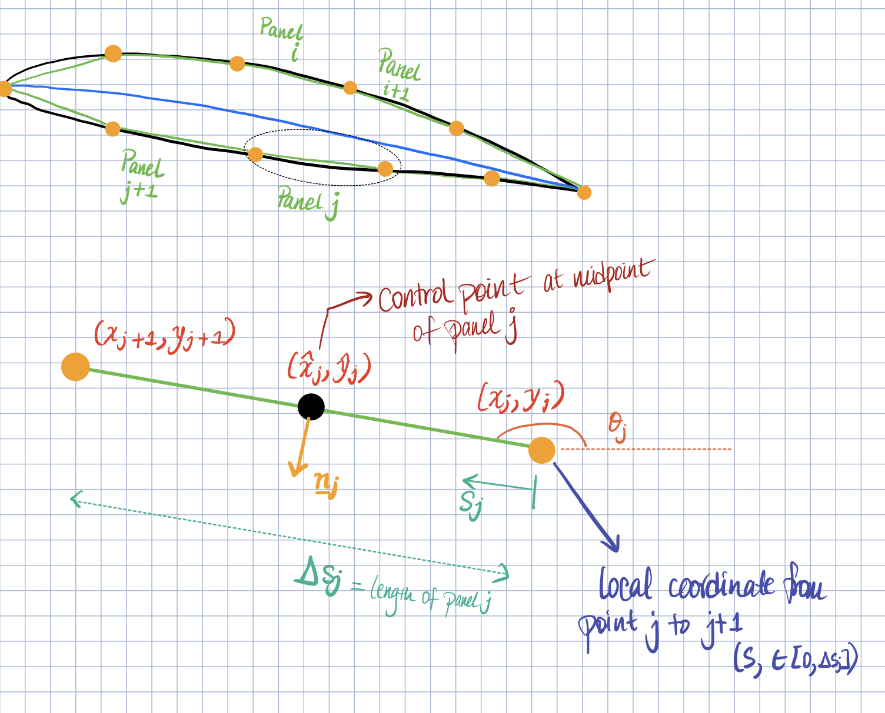

---
title: "AE 311: Individual Project 2"
date: \today
author: "Varsha Krishnakumar, varshak3@illinois.edu"
---  

#### 1. What assumptions are you making in developing your vortex panel method?

In developing the vortex panel method, it can be assumed that 2-dimensional flow (that is steady, inviscid, incompressible and irrotational) is the same as it approaches the airfoil, as well as when the flow is far away from the airfoil. It can also be assumed that the airfoil is a streamline, and correspondingly, no-penetration velocity can be assumed. The approaching flow can be surmised as tangent to the airfoil. 

The airfoil surface can be broken down into numerous discrete panels. To use the condition ∇²φ = 0, *Potential Flow* can be assumed, as well as the satisfaction of the *Kutta* condition. In developing the vortex panel method, the *First-Order Method* will be acquired. 

#### 2. Create a sketch that defines your nomenclature. How are the panels indexed and defined, what local coordinate systems and variables are needed to define quantities on each panel, etc.? 

The surface of the airfoil can be broken down into discrete "panels", where each panel is represented using a vortex sheet of linear distribution. The reasoning for this theory is that as the number of panels are increased, the velocity boundary conditions are imposed on an increasingly better representation of the airfoil surface. On the top surface of the airfoil, each panel is represented by $i$, and a numerical incrementation of 1. Similarly, each panel on the bottom surface is represented by $j$., and a numerical incrementation of 1. 

*The control point at j can be written as:* 
    

<!-- $\hat{x_j} = {x_j} + \frac{Δs_j^x}{2}$, -->

where 
    

<!-- $$Δs_j^x = Δs_j cosθ_j$$ -->

And
    

<!-- $\hat{y_j} = y_j + \frac{Δs_j^y}{2}$, -->

where
    
    <!-- $$Δs_j^y = Δs_j sinθ_j$$ -->

The vortex strength at some $s_j$ along panel $j$ is:
    

<!-- $$γ(s_j) = γ_j + (γ_{j + 1} - γ)\frac{s_j}{Δs_j}$$ -->

#### 3. What is the procedure for developing the panel method? 

#### 4. Describe the unknowns that you will be solving for. What are these unknowns and why are they useful in predicting the flow past an airfoil?

#### 5. Develop a linear (matrix) system to solve for the problem unknowns. Your final result should be a matrix system that looks like $A = b$, where the unknowns are contained in the vector . This linear system should be solvable, so be sure you incorporate all equations needed to fully constrain the solution.

